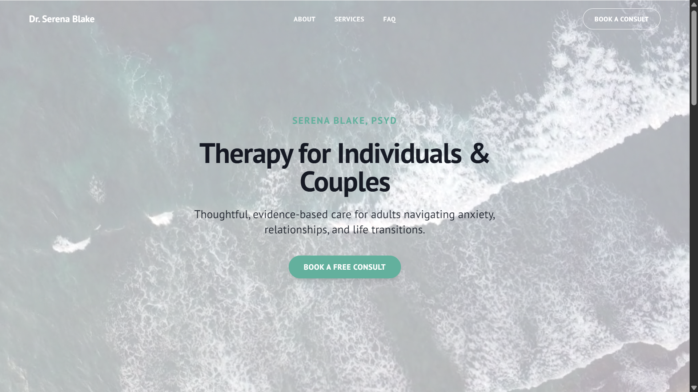

# Serena Blake Psychology Website

A professional, mobile-friendly portfolio website for a clinical psychologist, Dr. Serena Blake. This project showcases a modern, clean, and thoughtful user interface built with a production-ready tech stack.

**[Visit the Live Site](https://serena-blake-psychology.vercel.app/)**

## Desktop View



### Mobile View

<!--  -->


## ✨ Key Features

- **Fully Responsive Design:** A seamless experience across all devices, from mobile phones to desktops.
- **Interactive Service Modals:** Users can click on services to view detailed descriptions in an elegant pop-up dialog without leaving the page.
- **Comprehensive Consultation Form:** A detailed and user-friendly form for new client inquiries, built with validation.
- **Modern UI/UX:** A clean, calming aesthetic built with ShadCN UI and Tailwind CSS, featuring smooth scrolling and subtle animations.
- **Optimized for Performance:** Built with Next.js App Router and Server Components for fast load times.

## 🛠️ Tech Stack

**Framework**


**Language**

> 

**Styling & UI**

>  >  > 

**Forms & Validation**

> 

## 🚀 Getting Started

To run this project locally, follow these steps:

1. **Clone the repository:**

   ```bash
   git clone https://github.com/YourUsername/serena-blake-psychology.git
   cd serena-blake-psychology
   ```

2. **Install dependencies:**

   ```bash
   npm install
   ```

3. **Run the development server:**

   ```bash
   npm run dev
   ```

4. Open [http://localhost:9002](http://localhost:9002) in your browser to see the result.

## 🌐 Deployment to Vercel

This application is optimized for deployment on [Vercel](https://vercel.com/), the platform from the creators of Next.js.

1. **Push to GitHub:** Ensure your latest code is committed and pushed to your GitHub repository.

2. **Import Project on Vercel:**

   - Sign up for a free account on Vercel.
   - From your dashboard, click "Add New..." and select "Project".
   - Import your GitHub repository.

3. **Configure & Deploy:** Vercel will automatically detect that this is a Next.js project and configure the build settings correctly. You shouldn't need to change anything. Just click the "Deploy" button.

Vercel will build your site and provide you with a live URL once it's finished.

---

_Note: The `apphosting.yaml` file in this repository is included for compatibility with Google Cloud / Firebase App Hosting, but Vercel is the recommended deployment platform for this project as per the original problem statement._
